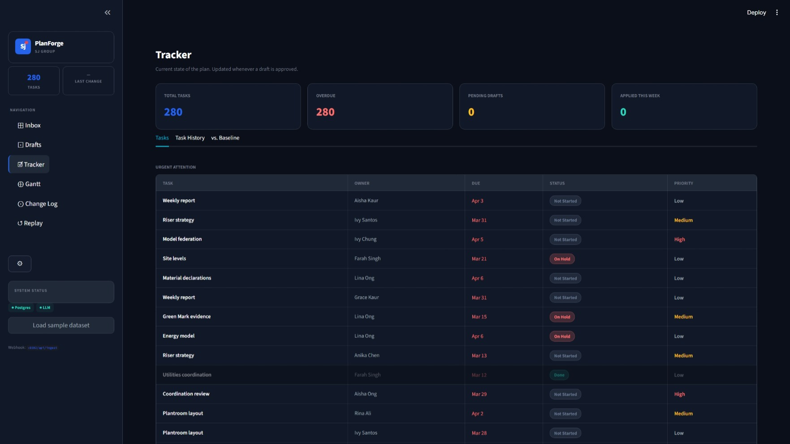
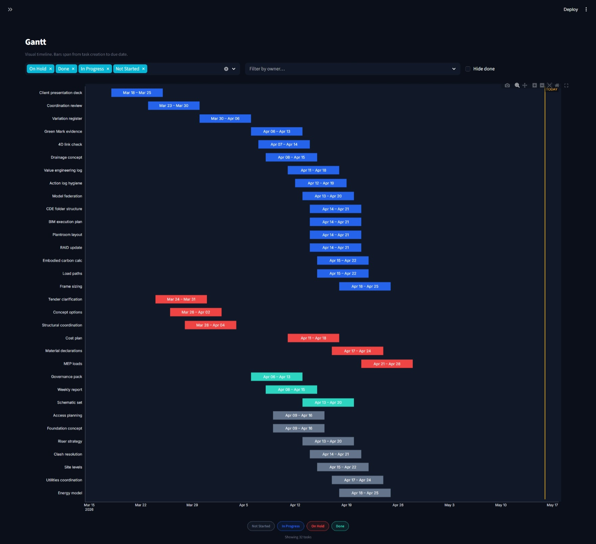
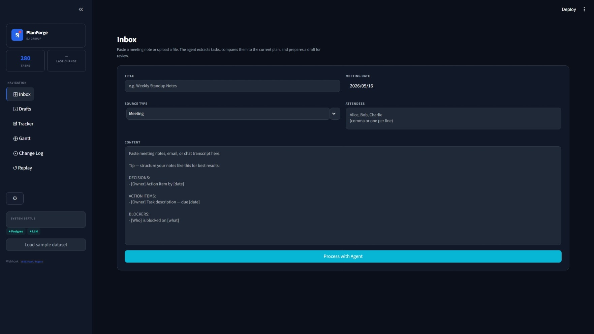
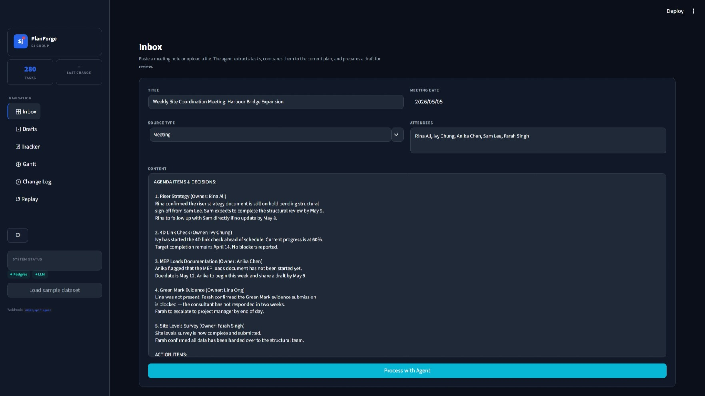
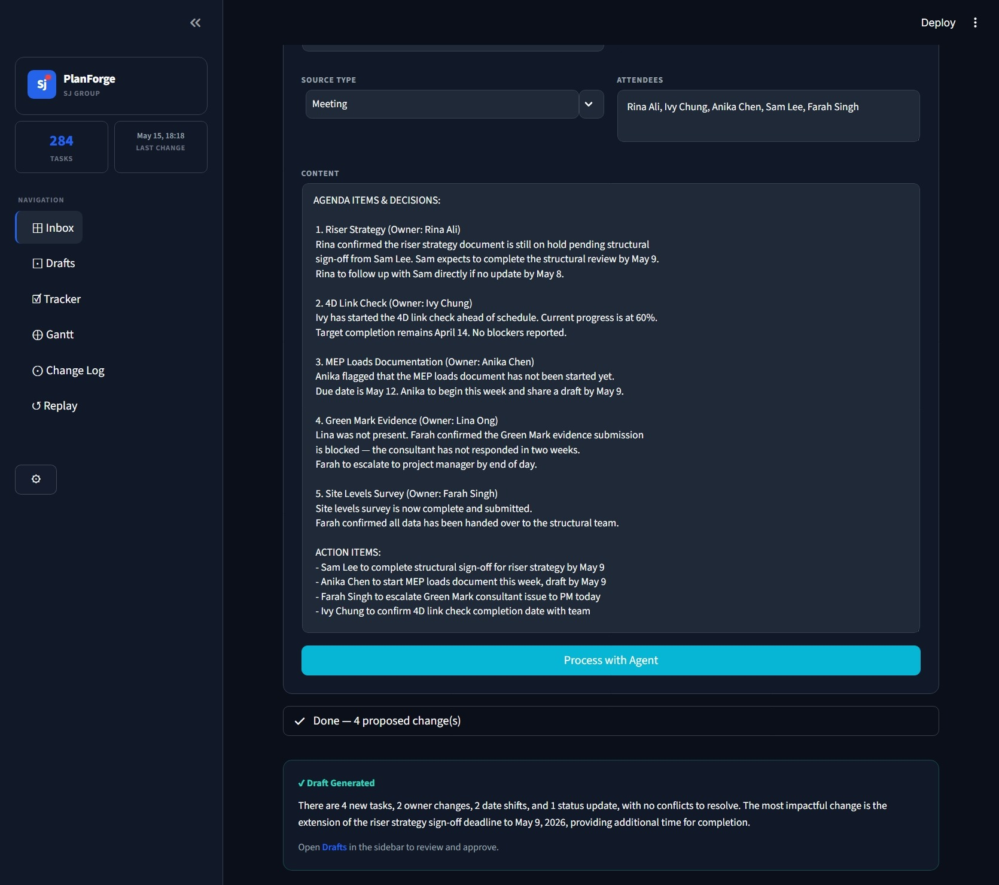
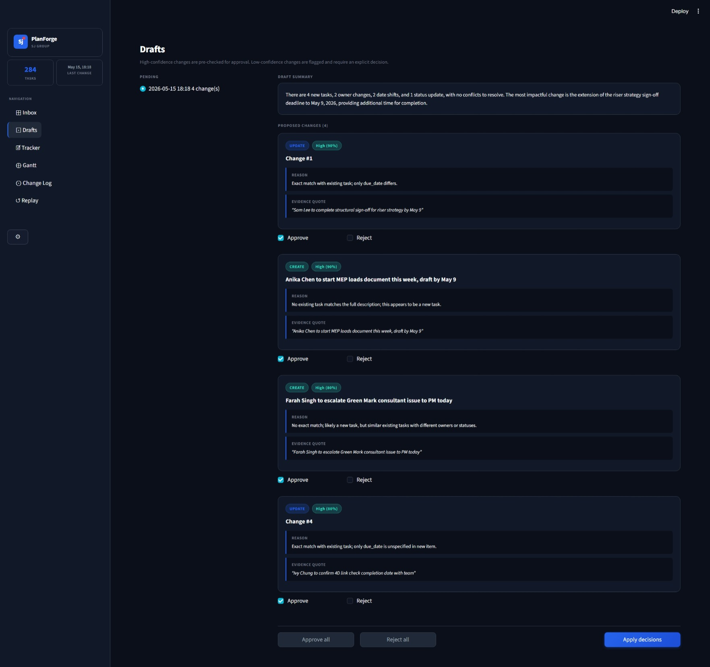
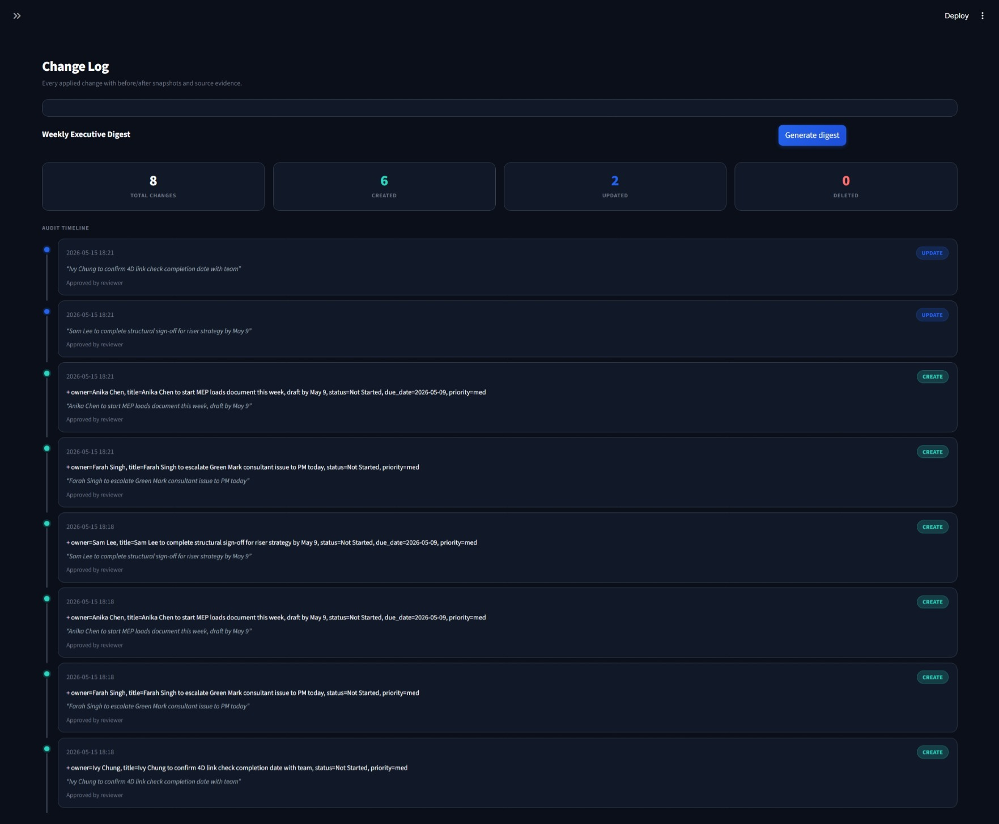
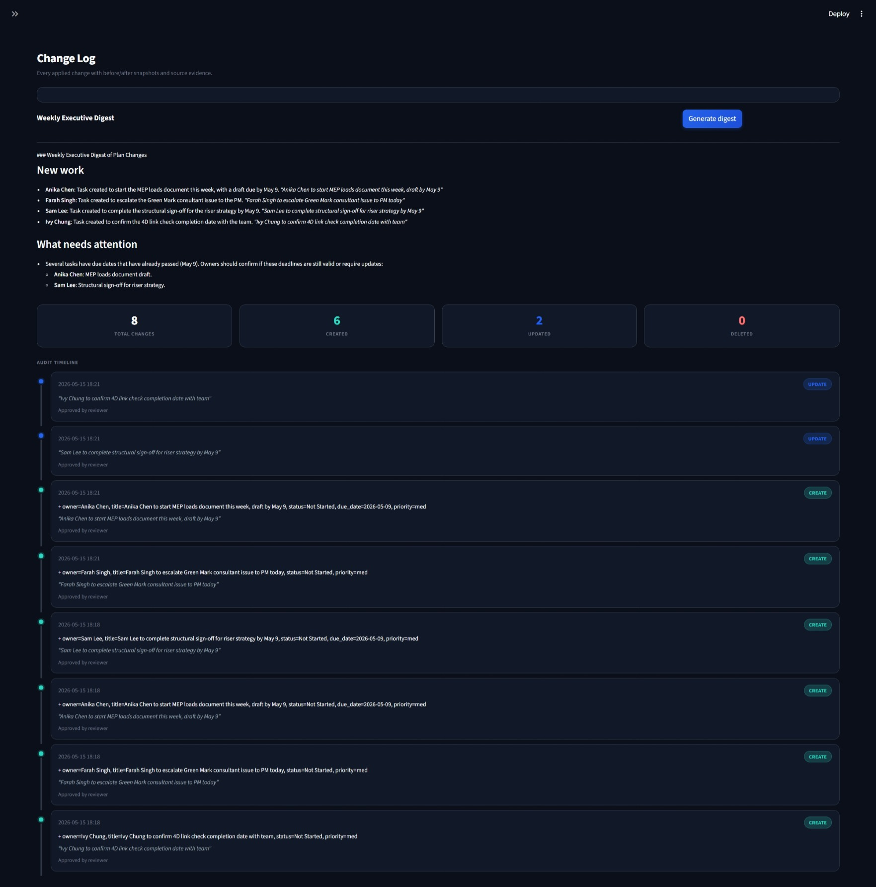
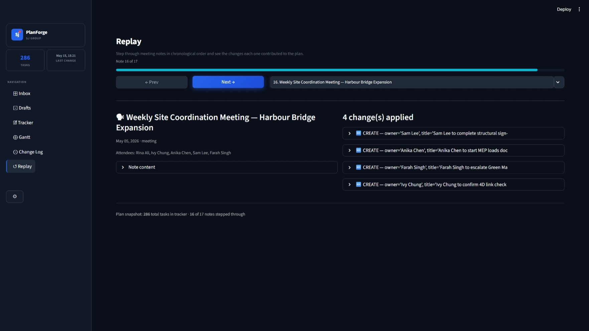

# PlanForge — SJ Project Planner Agent

> Agentic AI assistant that converts unstructured project conversations into structured, auditable plan updates — with a human-in-the-loop approval workflow.

**Microsoft Code Without Barriers Hackathon 2026** · Challenge: SJ Project Planner Agent · Solo submission

---

## Live Demo

🔗 **https://sjplanner-sm2026.calmbush-865eff5f.eastasia.azurecontainerapps.io/**

## Pitch Video

🎬 **[YouTube URL — to be added]**

---

## Screenshots

| Tracker | Gantt |
|---|---|
|  |  |

| Inbox | Inbox — Filled |
|---|---|
|  |  |

| Agent Result | Drafts |
|---|---|
|  |  |

| Change Log | Digest |
|---|---|
|  |  |

| Replay |
|---|
|  |

---

## What it does

Project plans drift out of sync with reality because decisions made in meetings and emails never make it back into the official tracker. PlanForge fixes this:

1. **Ingests** a meeting note, email, or chat message via the Inbox
2. **Extracts** task-shaped items — title, owner, due date, status, and a verbatim evidence quote from the source
3. **Classifies** each item as a new task, an update to an existing task, or a conflict requiring human clarification
4. **Drafts** a structured plan-update proposal with an executive-friendly summary
5. **Presents** the draft to a human reviewer who approves or rejects each change individually
6. **Commits** approved changes atomically, recording a full before/after audit trail

Nothing reaches the official tracker without explicit human approval.

---

## Key Features

### Core
- **Meeting-to-plan translation** — extract tasks, owners, due dates, and status signals from natural-language notes and emails
- **Three-way classification** — NEW task / UPDATE existing / CONFLICT requiring clarification
- **Plan update draft** — every proposed change paired with the verbatim evidence quote from the source
- **Tracker + Gantt** — filterable task table with overdue/due-soon colour cues and a Plotly Gantt timeline

### Human-in-the-Loop
- **Per-change approve/reject controls** — bulk or individual, applied atomically
- **Confidence-driven UX** — high-confidence changes pre-checked; low-confidence flagged and requiring explicit action
- **First-class conflict resolution** — side-by-side candidate comparison with Merge / Keep Separate

### Traceability
- **Evidence-quote pinning** — every applied change traceable to the exact source sentence
- **Full audit trail** — Change Log with before/after diffs, timestamps, and approver
- **Weekly executive digest** — one-click AI summary of the last 7 days of plan changes
- **Replay mode** — step through all ingested notes chronologically to see exactly what each contributed

---

## Architecture

```
┌──────────────────────────────────────────────────────────────┐
│          Streamlit Web App (Azure Container Apps)             │
│  Inbox · Drafts · Tracker · Gantt · Change Log · Replay      │
└──────────────────┬───────────────────────────────────────────┘
                   │
                   ▼
┌──────────────────────────────────────────────────────────────┐
│                       PlannerService                          │
│     ingest_note · run_pipeline · apply_draft · digest         │
└───────────┬──────────────────────────────┬────────────────────┘
            │                              │
            ▼                              ▼
┌───────────────────────┐    ┌─────────────────────────────────┐
│  PlannerAgent         │    │  Repository layer                │
│  extract_tasks        │    │  meeting_notes · tasks           │
│  batch_classify       │    │  pending_drafts · change_log     │
│  generate_draft       │    └────────────────┬────────────────┘
│  summarize_changes    │                     │
└───────────┬───────────┘                     ▼
            │                   ┌─────────────────────────────┐
            ▼                   │  Azure Database for          │
┌───────────────────────┐       │  PostgreSQL Flexible Server  │
│  Azure OpenAI         │       └─────────────────────────────┘
│  gpt-4o  (extract)    │
│  gpt-4.1-nano (classify)│
└───────────────────────┘
```

**Four layers with strict one-way dependencies:**
- **UI** — pure presentation, no business logic
- **PlannerService** — owns the pipeline workflow
- **PlannerAgent** — four LLM-backed tools with Pydantic-validated structured outputs
- **Repository layer** — typed CRUD over four PostgreSQL tables

---

## Tech Stack

| Layer | Technology |
|---|---|
| LLM | Azure OpenAI — `gpt-4o` (extraction) + `gpt-4.1-nano` (classification) |
| Storage | Azure Database for PostgreSQL Flexible Server (SQLAlchemy 2 + Alembic) |
| UI | Streamlit + Plotly |
| Deployment | Azure Container Apps + Azure Container Registry |
| Language | Python 3.12 |
| Testing | pytest (unit + live integration tests) |
| CI | GitHub Actions (ruff lint + pytest on every push) |

---

## Dataset

Uses the official **CWB_SJ dataset** (CC0 license) from [github.com/DoreenSteven/CWB_SJ](https://github.com/DoreenSteven/CWB_SJ):
- `tasks_master.csv` → loaded as the baseline plan (~284 tasks)
- `meeting_notes.jsonl` → first 10 notes available to process through the agent
- `emails.csv` → first 5 emails available as email-type meeting notes

Click **Load sample dataset** in the sidebar to populate the app instantly.

---

## Run Locally

**Prerequisites:** Python 3.12, Docker Desktop, an Azure OpenAI resource with `gpt-4o` and `gpt-4.1-nano` deployments.

```powershell
# 1. Clone
git clone https://github.com/SamMorales-stack/CWB_Project.git
cd CWB_Project

# 2. Start local Postgres
docker compose up -d

# 3. Python environment
python -m venv .venv
.venv\Scripts\Activate.ps1      # PowerShell on Windows
pip install -e ".[dev]"

# 4. Configure
copy .env.example .env
# Edit .env — set AZURE_OPENAI_ENDPOINT, AZURE_OPENAI_API_KEY, and DATABASE_URL

# 5. Run migrations
python -m alembic upgrade head

# 6. Launch
streamlit run src/planner/ui/app.py
```

Open `http://localhost:8501`, click **Load sample dataset** in the sidebar, then go to Inbox to process a meeting note.

---

## Deploy to Azure

Requires Azure CLI (`az login`) and an Azure subscription with Container Apps access.

```bash
export APP_NAME="sjplanner-<your-suffix>"        # globally unique
export LOCATION="eastasia"                        # match your subscription region
export AZURE_OPENAI_API_KEY="your-api-key"
export AZURE_OPENAI_ENDPOINT="https://<resource>.cognitiveservices.azure.com/"
export PG_ADMIN_PASSWORD="A-strong-password-123!"

./infra/deploy.sh
```

The script provisions in one shot: Resource Group → Azure Container Registry (image build + push) → PostgreSQL Flexible Server → Container Apps environment → Container App. Prints the live URL on completion.

---

## Tests

```bash
# Unit tests (mocked LLM, requires Postgres running)
python -m pytest -m "not live" -v

# Live integration tests (real Azure OpenAI calls)
python -m pytest -m live -v
```

---

## AI Tool Usage Disclosure

Per the hackathon's Generative AI Tools policy, this submission used:

- **Claude Code (Anthropic, claude-sonnet-4-6)** — architecture design, implementation planning, and code generation throughout the project.
- **Azure OpenAI (gpt-4o + gpt-4.1-nano)** — the LLM models powering the application's agent pipeline at runtime.

No AI-generated assets contain sensitive, confidential, or proprietary information. All code was developed during the hackathon period.
