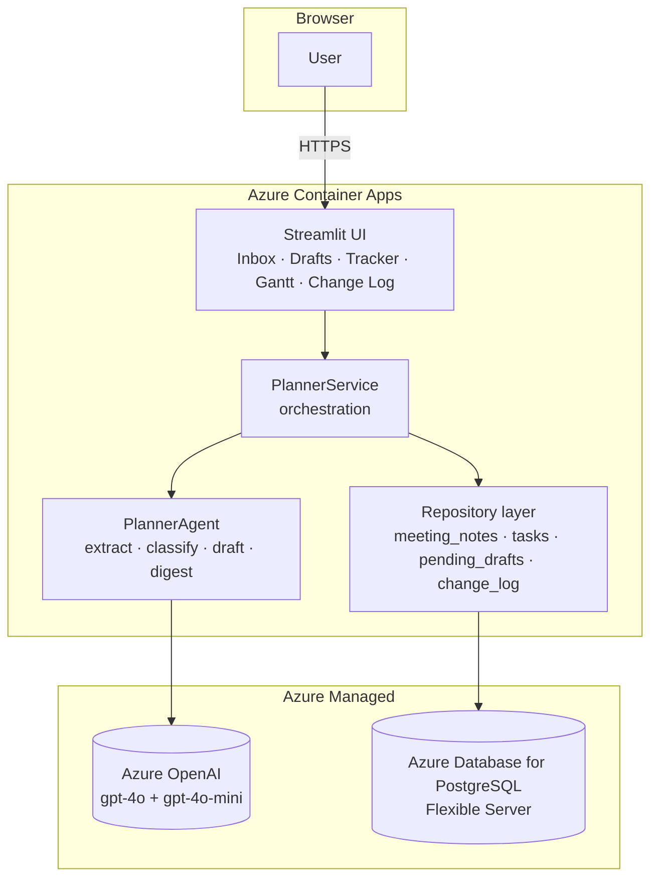
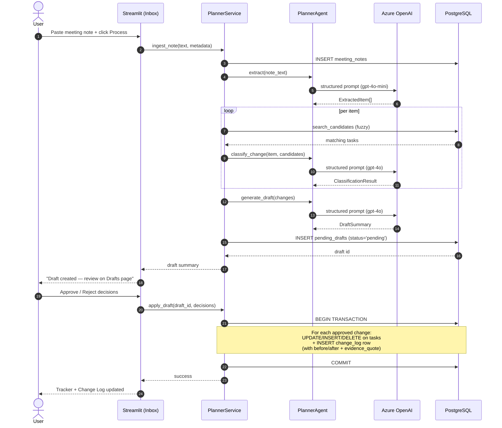

# Architecture

## Layer responsibilities

The application is split into four units with strictly one-way dependencies. Each unit answers one question and depends only on the units beneath it.

- **Streamlit UI** (`planner.ui`) — pure presentation and user input. Imports nothing from the agent layer directly. Calls into `PlannerService` via plain Python function calls. Holds no business logic.
- **PlannerService** (`planner.service`) — owns the workflow: ingest a note, run the extract-classify-draft pipeline, await approval, commit approved changes, generate the weekly digest. Has no Streamlit imports and no LLM-vendor-specific code.
- **PlannerAgent** (`planner.agent`) — wraps the structured LLM tool calls. Defines four tools — `extract_tasks`, `classify_change`, `generate_draft`, `summarize_changes` — each a thin wrapper around an Azure OpenAI call validated against a Pydantic schema.
- **Repository layer** (`planner.repositories`) — typed CRUD per table. Pure data access, no LLM awareness.

## Data flow: one meeting note end-to-end

## Why this shape

- **Strict boundaries** make each unit independently testable. The UI mocks the service. The service mocks the agent. The agent layer is the only place that knows about LLMs. The repositories are the only place that knows about Postgres.
- **Single source of truth** — the `tasks` table is the canonical plan. The `change_log` is the auditable history of how it changed, with every row carrying the verbatim source `evidence_quote`. There is no plan edit anywhere in the system that does not point back to a meeting note.
- **Transactional commits** — `apply_draft` is all-or-nothing per draft. A half-applied plan update is worse than no update at all.
- **Stateless agent** — the `PlannerAgent` holds no instance state; every tool call is a fresh structured prompt. Retries and structured-output validation live in the client wrapper.
